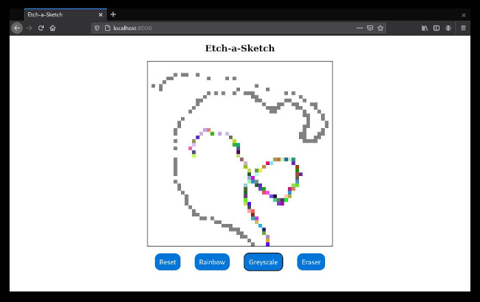

# Etch-a-Sketch

This is a web based version of the classic game Etch-a-Sketch. It's written in JavaScript and runs in the browser. The stylus has three different color modes (including eraser) and it also gives the user the ability to wipe the screen and change its resolution.

## Getting Started

These instructions will get you a copy of the project up and running on your local machine for development and testing purposes.

### Prerequisites

Things you need:

```
Any modern browser i.e. Firefox, Opera, Safari, etc...
```

### Installing

To run this project you will simply need a web browser to load the index.html document




## Built With

* [Sublime-Text](http://www.sublimetext.com/docs/3/) - Development environment

## Authors

* **N.T. Carruthers**  - [GitHub](https://github.com/gif007)

## License

This project is licensed under the MIT License - see the [LICENSE.md](LICENSE.md) file for details

## Acknowledgments

* Hat tip to the [Odin Project](https://www.theodinproject.com/) for the inspiration for this project